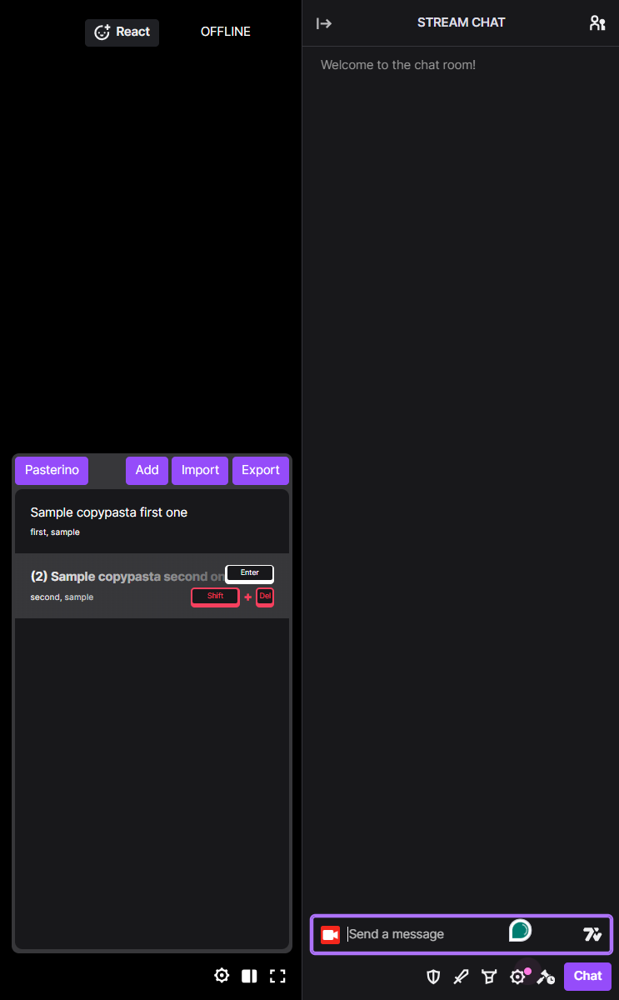

# pasterino

Your web browser extension for managing Twitch copy-pastas

Pasterino widget next to chatbox like this:

# Installation

1. Download [latest release](https://github.com/CaptSiro/pasterino/releases)
2. Extract zip file
3. Click to your browser version to manage extensions:
    - Google Chrome: [link](chrome://extensions/)
    - Opera: [link](chrome://extensions/)
    - Opera GX: [link](chrome://extensions/)
    - Edge: [link](edge://extensions/)
4. Enable developer mode
    - Chrome: top right
    - Opera: top right
    - Opera GX: top right
    - Edge: left panel
5. Click load unpacked button
6. Select directory where you have extracted the zip file

# Usage

To open Pasterino widget you must have cursor inside chat and then
press:

`CTRL` + `SPACE` or `CTRL` + `SHIFT` + `SPACE`

I feel like that the buttons on top are self-explanatory but here
is what they do:

`Pasterino` - shameless self promo

`Add` - shows dialog to add new copy-pasta

`Import` - shows dialog to import copy-pastas from file

`Export` - downloads file that contains all saved copy-pasta

### Copy-pasta selection

To move selection, press up or down key

Pressing `Enter` key will paste and submit selected copy-pasta

Clicking on copy-pasta will only paste it

### Searching

To search copy-pasta by its content, start typing into chat prompt

To search by tags type: `tag=tag1 tag=tag2 tag=tag3` or `tag=tag1,tag2,tag3`

To search by channel type: `channel=btmc` To search for a global 
copy-pastas type: `channel=` To show copy-pastas from all channels,
type: `channel=*`

You can combine searching in any way you would like. Example:
`tag=tag1 content of channel=btmc my copy-pasta` which will try to
search for copy-pasta that has content: `content of my copy-pasta`
belongs to channel: `btmc` and has tag: `tag1`